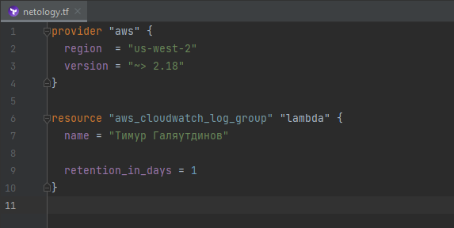
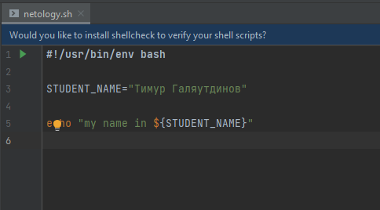
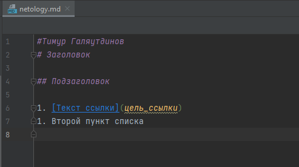
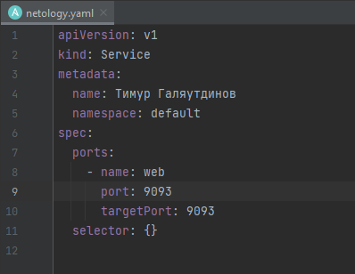
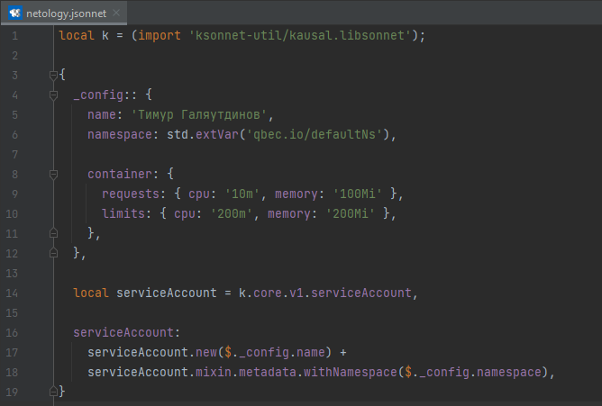

#Домашнее задание к занятию «1.1. Введение в DevOps»

## Задание №1 - Подготовка рабочей среды

  - Terraform: 
  - 
  - Bash: 
  - 
  - Markdown: 
  - 
  - Yaml: 
  - 
  - Jsonnet: 
  - 

## Задание №2 - Описание жизненного цикла задачи

1. Аналитика.
2. Техническое проектирвание.
3. Реализация:
   - Обеспечение поставки в dev и test среды. 
   - Автоматизация проверка исходного кода.
   - Автоматизированное интеграционное тестирование, запуск функциональных авто-тестов.
4. Тестирование:
   - Автоматизированная поставка релизов в тест среду. 
5. Поставка.
   - Происходит путем сборки контейнеров с определенным тегом.
   - В любой момент можно откатиться в любой среде на любую версию которая имеется в репозитории.