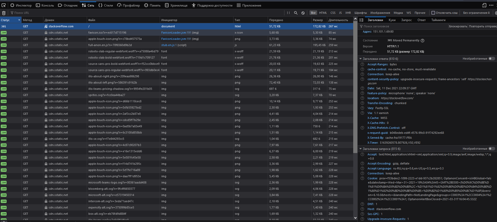
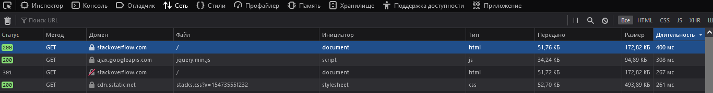

# Домашнее задание к занятию "3.6. Компьютерные сети, лекция 1"

1. HTTP/1.1 301 Moved Permanently - "перемещен навсегда". Используется для перенаправления бразуера на другую страницу. чаще всего на HTTPS страницу.

2. Первым пришел код http код 301. в заголовках в секции location указано https://stackoverflow.com. Самый долгий запросбыл 400мс с кодом 200 по адресу /



 
3.

```
curl ifconfig.me
85.140.2.247
```

```
dig +short myip.opendns.com @resolver1.opendns.com
85.140.2.247
```

4. 

```
whois -h whois.ripe.net 85.140.2.247
...
% Information related to '85.140.0.0/21AS8359'

route:          85.140.0.0/21
descr:          MTS gprs-infra in Volga-region
origin:         AS8359
mnt-by:         MTU-NOC
created:        2015-08-05T16:38:42Z
last-modified:  2015-08-05T16:38:42Z
source:         RIPE
```

Адрес принадлежит MTC. номер автономной сети 8359

5. 

```
traceroute -An 8.8.8.8
traceroute to 8.8.8.8 (8.8.8.8), 30 hops max, 60 byte packets
 1  172.19.240.1 [*]  0.476 ms  0.363 ms  0.326 ms
 2  192.168.8.1 [*]  1.023 ms  1.349 ms  0.941 ms
 3  172.16.11.194 [*]  35.530 ms  35.494 ms  35.463 ms
 4  172.16.10.250 [*]  35.618 ms  35.582 ms  35.529 ms
 5  85.140.1.253 [AS8359]  35.504 ms  35.470 ms  35.443 ms
 6  195.34.59.98 [AS8359]  40.070 ms  43.870 ms  43.798 ms
 7  212.188.28.169 [AS8359]  43.667 ms  43.620 ms  37.579 ms
 8  212.188.29.82 [AS8359]  44.082 ms  44.056 ms  44.042 ms
 9  * * 108.170.250.99 [AS15169]  44.059 ms
10  209.85.255.136 [AS15169]  63.822 ms  63.794 ms 172.253.66.116 [AS15169]  63.812 ms
11  172.253.66.110 [AS15169]  63.754 ms 74.125.253.94 [AS15169]  58.701 ms  69.583 ms
12  172.253.64.57 [AS15169]  79.522 ms 172.253.64.55 [AS15169]  79.429 ms 216.239.57.5 [AS15169]  69.450 ms
13  * * *
14  * * *
15  * * *
16  * * *
17  * * *
18  * * *
19  8.8.8.8 [AS15169]  55.908 ms * *
```

6.

```
mtr -z -c 5 -r 8.8.8.8
Start: 2021-12-12T01:39:06+0300
HOST: exad-winhome                Loss%   Snt   Last   Avg  Best  Wrst StDev
  1. AS???    exad-winhome.mshome  0.0%     5    0.7   0.5   0.4   0.7   0.1
  2. AS???    homerouter.cpe       0.0%     5    1.2   1.3   1.1   1.6   0.2
  3. AS???    172.16.11.194        0.0%     5   21.6  28.4  19.9  45.7  10.3
  4. AS???    172.16.10.254        0.0%     5   24.9  27.0  24.9  31.6   2.7
  5. AS8359   pgag-cr02-ae52.100.  0.0%     5   25.1  29.0  24.7  36.2   4.8
  6. AS8359   bek-cr01-be5.52.nno  0.0%     5   31.6  37.3  30.5  51.8   8.8
  7. AS8359   mag9-cr02-be3.52.ms  0.0%     5   30.6  33.2  27.8  45.8   7.2
  8. AS8359   mag9-cr01-be16.77.m  0.0%     5   33.0  33.5  30.0  39.2   3.5
  9. AS???    ???                 100.0     5    0.0   0.0   0.0   0.0   0.0
 10. AS15169  142.250.239.64      20.0%     5   77.8  56.1  47.7  77.8  14.5
 11. AS15169  108.170.232.251      0.0%     5   60.0  50.5  45.4  60.0   5.7
 12. AS15169  142.250.236.77       0.0%     5   45.7  50.4  44.6  57.9   5.7
 13. AS???    ???                 100.0     5    0.0   0.0   0.0   0.0   0.0
 14. AS???    ???                 100.0     5    0.0   0.0   0.0   0.0   0.0
 15. AS???    ???                 100.0     5    0.0   0.0   0.0   0.0   0.0
 16. AS???    ???                 100.0     5    0.0   0.0   0.0   0.0   0.0
 17. AS???    ???                 100.0     5    0.0   0.0   0.0   0.0   0.0
 18. AS???    ???                 100.0     5    0.0   0.0   0.0   0.0   0.0
 19. AS???    ???                 100.0     5    0.0   0.0   0.0   0.0   0.0
 20. AS???    ???                 100.0     5    0.0   0.0   0.0   0.0   0.0
 21. AS15169  dns.google          60.0%     5   45.0  46.4  45.0  47.8   2.0
```
Самая долгая задержка по средним показателям на 10 хопе 56.1

7.

```
dig dns.google ns

; <<>> DiG 9.16.1-Ubuntu <<>> dns.google ns
;; global options: +cmd
;; Got answer:
;; ->>HEADER<<- opcode: QUERY, status: NOERROR, id: 24817
;; flags: qr rd ad; QUERY: 1, ANSWER: 4, AUTHORITY: 0, ADDITIONAL: 0
;; WARNING: recursion requested but not available

;; QUESTION SECTION:
;dns.google.                    IN      NS

;; ANSWER SECTION:
dns.google.             0       IN      NS      ns2.zdns.google.
dns.google.             0       IN      NS      ns1.zdns.google.
dns.google.             0       IN      NS      ns3.zdns.google.
dns.google.             0       IN      NS      ns4.zdns.google.
```

За dns.goole отвечают DNS серверы ns2.zdns.google ns1.zdns.google ns3.zdns.google ns4.zdns.google

```
dig dns.google A

; <<>> DiG 9.16.1-Ubuntu <<>> dns.google A
;; global options: +cmd
;; Got answer:
;; ->>HEADER<<- opcode: QUERY, status: NOERROR, id: 34913
;; flags: qr rd ad; QUERY: 1, ANSWER: 2, AUTHORITY: 0, ADDITIONAL: 0
;; WARNING: recursion requested but not available

;; QUESTION SECTION:
;dns.google.                    IN      A

;; ANSWER SECTION:
dns.google.             0       IN      A       8.8.8.8
dns.google.             0       IN      A       8.8.4.4
```
А записи ссылаются на 8.8.8.8 8.8.4.4

8.

```
dig -x 8.8.8.8

; <<>> DiG 9.16.1-Ubuntu <<>> -x 8.8.8.8
;; global options: +cmd
;; Got answer:
;; ->>HEADER<<- opcode: QUERY, status: NOERROR, id: 64173
;; flags: qr rd ad; QUERY: 1, ANSWER: 1, AUTHORITY: 0, ADDITIONAL: 0
;; WARNING: recursion requested but not available

;; QUESTION SECTION:
;8.8.8.8.in-addr.arpa.          IN      PTR

;; ANSWER SECTION:
8.8.8.8.in-addr.arpa.   0       IN      PTR     dns.google.
```

```
dig -x 8.8.4.4

; <<>> DiG 9.16.1-Ubuntu <<>> -x 8.8.4.4
;; global options: +cmd
;; Got answer:
;; ->>HEADER<<- opcode: QUERY, status: NOERROR, id: 18035
;; flags: qr rd ad; QUERY: 1, ANSWER: 1, AUTHORITY: 0, ADDITIONAL: 0
;; WARNING: recursion requested but not available

;; QUESTION SECTION:
;4.4.8.8.in-addr.arpa.          IN      PTR

;; ANSWER SECTION:
4.4.8.8.in-addr.arpa.   0       IN      PTR     dns.google.
```
dns.google

