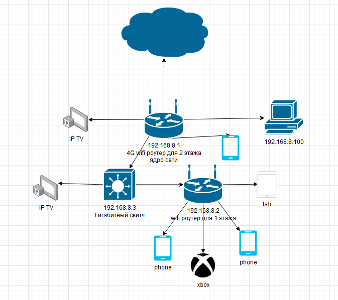

# Домашнее задание к занятию "3.8. Компьютерные сети, лекция 3"
1. 

```
telnet route-views.routeviews.org                                                                                                                                                                      148 ↵
Trying 128.223.51.103...
Connected to route-views.routeviews.org.
Escape character is '^]'.
C
**********************************************************************

                    RouteViews BGP Route Viewer
                    route-views.routeviews.org

 route views data is archived on http://archive.routeviews.org

 This hardware is part of a grant by the NSF.
 Please contact help@routeviews.org if you have questions, or
 if you wish to contribute your view.

 This router has views of full routing tables from several ASes.
 The list of peers is located at http://www.routeviews.org/peers
 in route-views.oregon-ix.net.txt

 NOTE: The hardware was upgraded in August 2014.  If you are seeing
 the error message, "no default Kerberos realm", you may want to
 in Mac OS X add "default unset autologin" to your ~/.telnetrc

 To login, use the username "rviews".

 **********************************************************************

User Access Verification

Username: rviews
route-views>show ip route 85.140.2.247
Routing entry for 85.140.0.0/21
  Known via "bgp 6447", distance 20, metric 0
  Tag 2497, type external
  Last update from 202.232.0.2 2d20h ago
  Routing Descriptor Blocks:
  * 202.232.0.2, from 202.232.0.2, 2d20h ago
      Route metric is 0, traffic share count is 1
      AS Hops 2
      Route tag 2497
      MPLS label: none
route-views>show bgp 85.140.2.247
BGP routing table entry for 85.140.0.0/21, version 1400982440
Paths: (23 available, best #10, table default)
  Not advertised to any peer
  Refresh Epoch 1
  3549 3356 8359
    208.51.134.254 from 208.51.134.254 (67.16.168.191)
      Origin IGP, metric 0, localpref 100, valid, external
      Community: 3356:2 3356:22 3356:100 3356:123 3356:519 3356:903 3356:2094 3549:2581 3549:30840 8359:5500 8359:55452 8359:64849
      path 7FE0F2471678 RPKI State not found
      rx pathid: 0, tx pathid: 0
  Refresh Epoch 1
  53767 14315 6453 6453 3356 8359
    162.251.163.2 from 162.251.163.2 (162.251.162.3)
      Origin IGP, localpref 100, valid, external
      Community: 14315:5000 53767:5000
      path 7FE09686F220 RPKI State not found
      rx pathid: 0, tx pathid: 0
  Refresh Epoch 1
  57866 3356 8359
    37.139.139.17 from 37.139.139.17 (37.139.139.17)
      Origin IGP, metric 0, localpref 100, valid, external
      Community: 3356:2 3356:22 3356:100 3356:123 3356:519 3356:903 3356:2094 8359:5500 8359:55452 8359:64849
      path 7FE02CBE85A0 RPKI State not found
      rx pathid: 0, tx pathid: 0
  Refresh Epoch 1
  3356 8359
    4.68.4.46 from 4.68.4.46 (4.69.184.201)
      Origin IGP, metric 0, localpref 100, valid, external
      Community: 3356:2 3356:22 3356:100 3356:123 3356:519 3356:903 3356:2094 8359:5500 8359:55452 8359:64849
      path 7FE10E005270 RPKI State not found
      rx pathid: 0, tx pathid: 0
  Refresh Epoch 1
  3333 8359
    193.0.0.56 from 193.0.0.56 (193.0.0.56)
      Origin IGP, localpref 100, valid, external
      Community: 8359:5500 8359:55452 8359:64849
      path 7FE021C4CB60 RPKI State not found
      rx pathid: 0, tx pathid: 0
  Refresh Epoch 1
  101 3356 8359
    209.124.176.223 from 209.124.176.223 (209.124.176.223)
      Origin IGP, localpref 100, valid, external
      Community: 101:20100 101:20110 101:22100 3356:2 3356:22 3356:100 3356:123 3356:519 3356:903 3356:2094 8359:5500 8359:55452 8359:64849
      Extended Community: RT:101:22100
      path 7FE0DDACE048 RPKI State not found
      rx pathid: 0, tx pathid: 0
  Refresh Epoch 1
  852 3356 8359
    154.11.12.212 from 154.11.12.212 (96.1.209.43)
      Origin IGP, metric 0, localpref 100, valid, external
      path 7FE0BEC478A8 RPKI State not found
      rx pathid: 0, tx pathid: 0
  Refresh Epoch 1
  20130 6939 8359
    140.192.8.16 from 140.192.8.16 (140.192.8.16)
      Origin IGP, localpref 100, valid, external
      path 7FE0C9EF4028 RPKI State not found
      rx pathid: 0, tx pathid: 0
  Refresh Epoch 1
  7660 2516 1299 8359
    203.181.248.168 from 203.181.248.168 (203.181.248.168)
      Origin IGP, localpref 100, valid, external
      Community: 2516:1030 7660:9003
      path 7FE0CDD75E70 RPKI State not found
      rx pathid: 0, tx pathid: 0
  Refresh Epoch 1
  2497 8359
    202.232.0.2 from 202.232.0.2 (58.138.96.254)
      Origin IGP, localpref 100, valid, external, best
      path 7FE0C6DDEC38 RPKI State not found
      rx pathid: 0, tx pathid: 0x0
  Refresh Epoch 1
  6939 8359
    64.71.137.241 from 64.71.137.241 (216.218.252.164)
      Origin IGP, localpref 100, valid, external
      path 7FE1669E6B90 RPKI State not found
      rx pathid: 0, tx pathid: 0
  Refresh Epoch 1
  20912 3257 3356 8359
    212.66.96.126 from 212.66.96.126 (212.66.96.126)
      Origin IGP, localpref 100, valid, external
      Community: 3257:8070 3257:30515 3257:50001 3257:53900 3257:53902 20912:65004
      path 7FE0F37D4038 RPKI State not found
      rx pathid: 0, tx pathid: 0
  Refresh Epoch 3
  3303 8359
    217.192.89.50 from 217.192.89.50 (138.187.128.158)
      Origin IGP, localpref 100, valid, external
      Community: 3303:1004 3303:1006 3303:1030 3303:3054 8359:5500 8359:55452 8359:64849
      path 7FE02006EE68 RPKI State not found
      rx pathid: 0, tx pathid: 0
  Refresh Epoch 1
  3561 3910 3356 8359
    206.24.210.80 from 206.24.210.80 (206.24.210.80)
      Origin IGP, localpref 100, valid, external
      path 7FE0E3F4D998 RPKI State not found
      rx pathid: 0, tx pathid: 0
  Refresh Epoch 1
  4901 6079 8359
    162.250.137.254 from 162.250.137.254 (162.250.137.254)
      Origin IGP, localpref 100, valid, external
      Community: 65000:10100 65000:10300 65000:10400
      path 7FE0DA1B5EC8 RPKI State not found
      rx pathid: 0, tx pathid: 0
  Refresh Epoch 1
  7018 3356 8359
    12.0.1.63 from 12.0.1.63 (12.0.1.63)
      Origin IGP, localpref 100, valid, external
      Community: 7018:5000 7018:37232
      path 7FE0C2D55D50 RPKI State not found
      rx pathid: 0, tx pathid: 0
  Refresh Epoch 1
  49788 12552 8359
    91.218.184.60 from 91.218.184.60 (91.218.184.60)
      Origin IGP, localpref 100, valid, external
      Community: 12552:12000 12552:12100 12552:12101 12552:22000
      Extended Community: 0x43:100:1
      path 7FE15DDB70E8 RPKI State not found
      rx pathid: 0, tx pathid: 0
  Refresh Epoch 1
  8283 8359
    94.142.247.3 from 94.142.247.3 (94.142.247.3)
      Origin IGP, metric 0, localpref 100, valid, external
      Community: 8283:1 8283:101 8359:5500 8359:55452 8359:64849
      unknown transitive attribute: flag 0xE0 type 0x20 length 0x18
        value 0000 205B 0000 0000 0000 0001 0000 205B
              0000 0005 0000 0001
      path 7FE022DB57C8 RPKI State not found
      rx pathid: 0, tx pathid: 0
  Refresh Epoch 1
  1221 4637 3356 8359
    203.62.252.83 from 203.62.252.83 (203.62.252.83)
      Origin IGP, localpref 100, valid, external
      path 7FE0AA556B40 RPKI State not found
      rx pathid: 0, tx pathid: 0
  Refresh Epoch 1
  701 3356 8359
    137.39.3.55 from 137.39.3.55 (137.39.3.55)
      Origin IGP, localpref 100, valid, external
      path 7FE0852E4E28 RPKI State not found
      rx pathid: 0, tx pathid: 0
  Refresh Epoch 1
  3257 3356 8359
    89.149.178.10 from 89.149.178.10 (213.200.83.26)
      Origin IGP, metric 10, localpref 100, valid, external
      Community: 3257:8794 3257:30043 3257:50001 3257:54900 3257:54901
      path 7FE0AFC7C948 RPKI State not found
      rx pathid: 0, tx pathid: 0
  Refresh Epoch 1
  1351 8359
    132.198.255.253 from 132.198.255.253 (132.198.255.253)
      Origin IGP, localpref 100, valid, external
      path 7FE07D6BE840 RPKI State not found
      rx pathid: 0, tx pathid: 0
  Refresh Epoch 1
  19214 3257 3356 8359
    208.74.64.40 from 208.74.64.40 (208.74.64.40)
      Origin IGP, localpref 100, valid, external
      Community: 3257:8108 3257:30048 3257:50002 3257:51200 3257:51203
      path 7FE11C678890 RPKI State not found
      rx pathid: 0, tx pathid: 0
```

2.

```
root@debian11:~# ip link add dummy0 type dummy
root@debian11:~# ip link list
1: lo: <LOOPBACK,UP,LOWER_UP> mtu 65536 qdisc noqueue state UNKNOWN mode DEFAULT group default qlen 1000
    link/loopback 00:00:00:00:00:00 brd 00:00:00:00:00:00
2: ens33: <BROADCAST,MULTICAST,UP,LOWER_UP> mtu 1500 qdisc pfifo_fast state UP mode DEFAULT group default qlen 1000
    link/ether 00:0c:29:2a:fb:7a brd ff:ff:ff:ff:ff:ff
    altname enp2s1
5: dummy0: <BROADCAST,NOARP> mtu 1500 qdisc noop state DOWN mode DEFAULT group default qlen 1000
    link/ether 86:ea:6b:14:56:6b brd ff:ff:ff:ff:ff:ff
```

```
ip add add 172.16.0.1/24 dev dummy0
ip link set dev dummy0 up
ip route add 1.0.0.0/8 via 172.16.0.1

route -n
Kernel IP routing table
Destination     Gateway         Genmask         Flags Metric Ref    Use Iface
0.0.0.0         192.168.198.2   0.0.0.0         UG    100    0        0 ens33
1.0.0.0         172.16.0.1      255.0.0.0       UG    0      0        0 dummy0
172.16.0.0      0.0.0.0         255.255.255.0   U     0      0        0 dummy0
192.168.198.0   0.0.0.0         255.255.255.0   U     100    0        0 ens33
```

3. 

```
netstat -tulpn
Active Internet connections (only servers)
Proto Recv-Q Send-Q Local Address           Foreign Address         State       PID/Program name
tcp        0      0 0.0.0.0:22              0.0.0.0:*               LISTEN      557/sshd: /usr/sbin
tcp6       0      0 :::22                   :::*                    LISTEN      557/sshd: /usr/sbin
udp        0      0 0.0.0.0:5353            0.0.0.0:*                           503/avahi-daemon: r
udp        0      0 0.0.0.0:36920           0.0.0.0:*                           503/avahi-daemon: r
udp6       0      0 :::40116                :::*                                503/avahi-daemon: r
udp6       0      0 :::5353                 :::*                                503/avahi-daemon: r
```

открыт 22 порт. используется для ssh использует tcp протокол. 
порт 5353 локальный демон для резолва dns запросов. используется протокол udp как для всех dns.

```
lsof -i :5353
COMMAND   PID  USER   FD   TYPE DEVICE SIZE/OFF NODE NAME
avahi-dae 503 avahi   12u  IPv4  16652      0t0  UDP *:mdns
avahi-dae 503 avahi   13u  IPv6  16653      0t0  UDP *:mdns
```

4. 

```
ss -napu
State              Recv-Q             Send-Q                                 Local Address:Port                              Peer Address:Port             Process
UNCONN             0                  0                                            0.0.0.0:5353                                   0.0.0.0:*                 users:(("avahi-daemon",pid=503,fd=12))
UNCONN             0                  0                                            0.0.0.0:36920                                  0.0.0.0:*                 users:(("avahi-daemon",pid=503,fd=14))
ESTAB              0                  0                              192.168.198.148%ens33:68                             192.168.198.254:67                users:(("NetworkManager",pid=506,fd=23))
UNCONN             0                  0                                               [::]:40116                                     [::]:*                 users:(("avahi-daemon",pid=503,fd=15))
UNCONN             0                  0                                               [::]:5353                                      [::]:*                 users:(("avahi-daemon",pid=503,fd=13))
```

5353 используется avahi-daemon который запускает mdns (видно по выводу в 3 задаче)

5.



