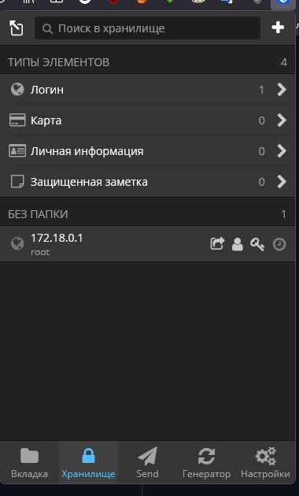
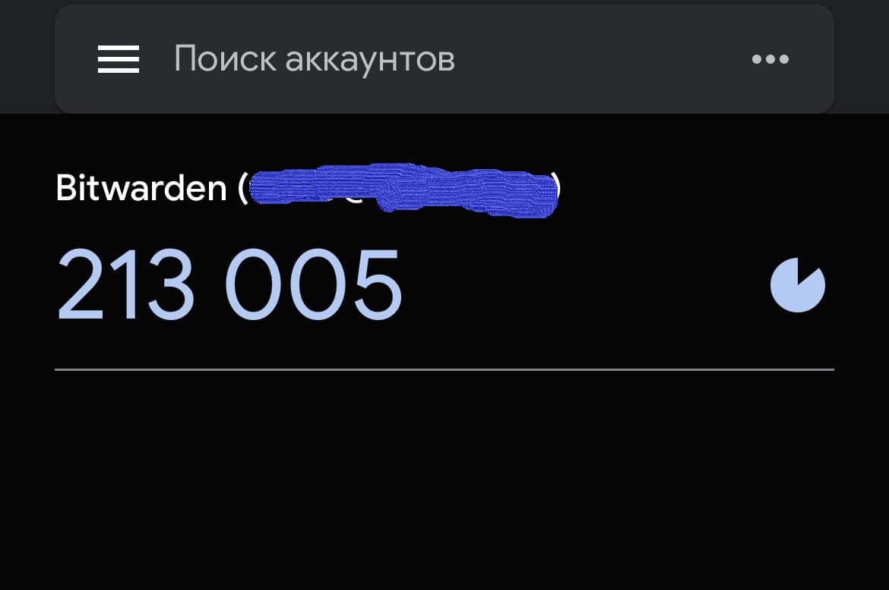
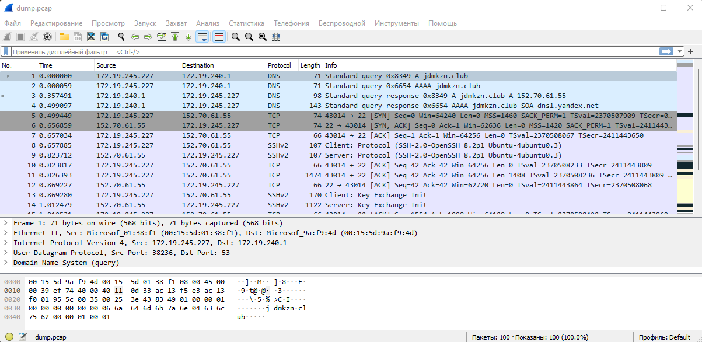

# Домашнее задание к занятию "3.9. Элементы безопасности информационных систем"

1.


2.


3.

```
apt install apache2

mkdir -p /etc/ssl/localcerts

openssl req -new -x509 -days 365 -nodes -out /etc/ssl/localcerts/apache.pem -keyout /etc/ssl/localcerts/apache.key

chmod 600 /etc/ssl/localcerts/apache*

a2enmod ssl

a2dissite 000-default.conf

a2ensite default-ssl.conf

systemctl reload apache2
```

сайт открывается по https://ip-address и так как был использован самоподписанный сертификат выходит предупреждение безопасности браузера. 

4. Скачал скрипт проверки TLS настроек веб-сервера с гитхаба https://github.com/drwetter/testssl.sh
Проверю на уязвимости сайт ya.ru:

```
./testssl.sh -U --sneaky https://ya.ru
...
...
 Testing vulnerabilities

 Heartbleed (CVE-2014-0160)                not vulnerable (OK), no heartbeat extension
 CCS (CVE-2014-0224)                       not vulnerable (OK)
 Ticketbleed (CVE-2016-9244), experiment.  not vulnerable (OK), reply empty
 ROBOT                                     VULNERABLE (NOT ok) - weakly vulnerable as the attack would take too long
 Secure Renegotiation (RFC 5746)           supported (OK)
 Secure Client-Initiated Renegotiation     not vulnerable (OK)
 CRIME, TLS (CVE-2012-4929)                not vulnerable (OK)
 BREACH (CVE-2013-3587)                    potentially NOT ok, "gzip" HTTP compression detected. - only supplied "/" tested
                                           Can be ignored for static pages or if no secrets in the page
 POODLE, SSL (CVE-2014-3566)               not vulnerable (OK)
 TLS_FALLBACK_SCSV (RFC 7507)              Check failed, unexpected result , run testssl.sh -Z --debug=1 and look at /tmp/testssl.4b3mHy/*tls_fallback_scsv.txt
 SWEET32 (CVE-2016-2183, CVE-2016-6329)    VULNERABLE, uses 64 bit block ciphers
 FREAK (CVE-2015-0204)                     not vulnerable (OK)
 DROWN (CVE-2016-0800, CVE-2016-0703)      not vulnerable on this host and port (OK)
                                           make sure you don't use this certificate elsewhere with SSLv2 enabled services
                                           https://censys.io/ipv4?q=26EB381642B07A05F7CA935101FC6492F91F7F0721995A8E577EDFB6723EBD1F could help you to find out
 LOGJAM (CVE-2015-4000), experimental      not vulnerable (OK): no DH EXPORT ciphers, no DH key detected with <= TLS 1.2
 BEAST (CVE-2011-3389)                     TLS1: ECDHE-RSA-AES128-SHA AES128-SHA DES-CBC3-SHA
                                           VULNERABLE -- but also supports higher protocols  TLSv1.1 TLSv1.2 (likely mitigated)
 LUCKY13 (CVE-2013-0169), experimental     potentially VULNERABLE, uses cipher block chaining (CBC) ciphers with TLS. Check patches
 Winshock (CVE-2014-6321), experimental    not vulnerable (OK)
 RC4 (CVE-2013-2566, CVE-2015-2808)        no RC4 ciphers detected (OK)
```

5.

```
apt install ssh

ssh-keygen
Generating public/private rsa key pair.
Enter file in which to save the key (/home/exad/.ssh/id_rsa):
Enter passphrase (empty for no passphrase):
Enter same passphrase again:
Your identification has been saved in /home/exad/.ssh/id_rsa
Your public key has been saved in /home/exad/.ssh/id_rsa.pub
The key fingerprint is:
SHA256:suhqul3owTPHVQ08mY7qvKbC4xCIRIaiKXskPU4YKs0 exad@debian11
The key's randomart image is:
+---[RSA 3072]----+
|.o         o.o   |
|*           =o   |
|+O         o...  |
|@.E       ...    |
|=*..  . S..      |
|. o. o =..       |
| ...o Oo+        |
|   o+* *+        |
|   .=++o..       |
+----[SHA256]-----+
...
...
ssh-copy-id another.server
/usr/bin/ssh-copy-id: INFO: Source of key(s) to be installed: "/home/exad/.ssh/id_rsa.pub"
/usr/bin/ssh-copy-id: INFO: attempting to log in with the new key(s), to filter out any that are already installed
/usr/bin/ssh-copy-id: INFO: 1 key(s) remain to be installed -- if you are prompted now it is to install the new keys
exad@another.server's password:

Number of key(s) added: 1

Now try logging into the machine, with:   "ssh -p '60123' 'another.server'"
and check to make sure that only the key(s) you wanted were added.


ssh another.server
Linux relay 4.19.0-17-amd64 #1 SMP Debian 4.19.194-3 (2021-07-18) x86_64

The programs included with the Debian GNU/Linux system are free software;
the exact distribution terms for each program are described in the
individual files in /usr/share/doc/*/copyright.

Debian GNU/Linux comes with ABSOLUTELY NO WARRANTY, to the extent
permitted by applicable law.
Last login: Sun Dec 12 21:27:41 2021 from 85.140.2.247
exad@another.server:~$
```
6. 
Переименовываем файлы ключей

```
mv ~/.ssh/id_rsa.pub ~/.ssh/test.pub
mv ~/.ssh/id_rsa ~/.ssh/test
```

Создаем кофиг ssh

```
m ~/.ssh/config
cat ~/.ssh/config
Host localhost
HostName localhost
IdentityFile ~/.ssh/test
User exad
```

Заходим по имени на локальный сервер

```
ssh localhost

The authenticity of host 'localhost (::1)' can't be established.
ECDSA key fingerprint is SHA256:HdACtWyGd4BMj+UFeAF027Ec0qYCJTwBv4G+WfChYjM.
Are you sure you want to continue connecting (yes/no/[fingerprint])? yes
Warning: Permanently added 'localhost' (ECDSA) to the list of known hosts.
exad@localhost's password:
Linux debian11 5.10.0-8-amd64 #1 SMP Debian 5.10.46-4 (2021-08-03) x86_64

The programs included with the Debian GNU/Linux system are free software;
the exact distribution terms for each program are described in the
individual files in /usr/share/doc/*/copyright.

Debian GNU/Linux comes with ABSOLUTELY NO WARRANTY, to the extent
permitted by applicable law.
Last login: Sun Dec 12 21:42:01 2021 from 192.168.198.1
exad@debian11:~$
```

7. Устанвил пакет tcpdump

```tcpdump -c 100 -w /mnt/c/Users/tim20/Documents/dump.pcap```


