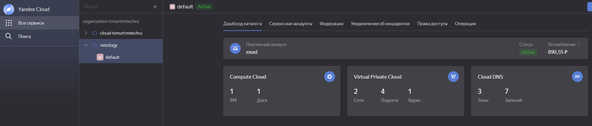

# Домашнее задание к занятию "7.2. Облачные провайдеры и синтаксис Terraform."

## Задача 1 (Вариант с Yandex.Cloud). Регистрация в ЯО и знакомство с основами (необязательно, но крайне желательно).

1. Подробная инструкция на русском языке содержится [здесь](https://cloud.yandex.ru/docs/solutions/infrastructure-management/terraform-quickstart).
2. Обратите внимание на период бесплатного использования после регистрации аккаунта. 
3. Используйте раздел "Подготовьте облако к работе" для регистрации аккаунта. Далее раздел "Настройте провайдер" для подготовки
базового терраформ конфига.
4. Воспользуйтесь [инструкцией](https://registry.terraform.io/providers/yandex-cloud/yandex/latest/docs) на сайте терраформа, что бы 
не указывать авторизационный токен в коде, а терраформ провайдер брал его из переменных окружений.

---

**Ответ**

```bash
$ yc config list
token: AQAEA7qh******************
cloud-id: b1gsr0qke7kms2agup99
folder-id: b1gp7d6r81g8bgn5e3jk
compute-default-zone: ru-central1-a
```

## Задача 2. Создание aws ec2 или yandex_compute_instance через терраформ. 

1. В каталоге `terraform` вашего основного репозитория, который был создан в начале курсе, создайте файл `main.tf` и `versions.tf`.
2. Зарегистрируйте провайдер 
   1. для [aws](https://registry.terraform.io/providers/hashicorp/aws/latest/docs). В файл `main.tf` добавьте
   блок `provider`, а в `versions.tf` блок `terraform` с вложенным блоком `required_providers`. Укажите любой выбранный вами регион 
   внутри блока `provider`.
   2. либо для [yandex.cloud](https://registry.terraform.io/providers/yandex-cloud/yandex/latest/docs). Подробную инструкцию можно найти 
   [здесь](https://cloud.yandex.ru/docs/solutions/infrastructure-management/terraform-quickstart).
3. Внимание! В гит репозиторий нельзя пушить ваши личные ключи доступа к аккаунту. Поэтому в предыдущем задании мы указывали
их в виде переменных окружения. 
4. В файле `main.tf` воспользуйтесь блоком `data "aws_ami` для поиска ami образа последнего Ubuntu.  
5. В файле `main.tf` создайте рессурс 
   1. либо [ec2 instance](https://registry.terraform.io/providers/hashicorp/aws/latest/docs/resources/instance).
   Постарайтесь указать как можно больше параметров для его определения. Минимальный набор параметров указан в первом блоке 
   `Example Usage`, но желательно, указать большее количество параметров.
   2. либо [yandex_compute_image](https://registry.terraform.io/providers/yandex-cloud/yandex/latest/docs/resources/compute_image).
6. Также в случае использования aws:
   1. Добавьте data-блоки `aws_caller_identity` и `aws_region`.
   2. В файл `outputs.tf` поместить блоки `output` с данными об используемых в данный момент: 
       * AWS account ID,
       * AWS user ID,
       * AWS регион, который используется в данный момент, 
       * Приватный IP ec2 инстансы,
       * Идентификатор подсети в которой создан инстанс.  
7. Если вы выполнили первый пункт, то добейтесь того, что бы команда `terraform plan` выполнялась без ошибок. 

---

**Ответ**

```bash
$ terraform plan
$ terraform apply

.............

Apply complete! Resources: 3 added, 0 changed, 0 destroyed.

Outputs:

external_ip_address_node01_yandex_cloud = "51.250.66.193"
internal_ip_address_node01_yandex_cloud = "192.168.1.11"

```


---

В качестве результата задания предоставьте:
1. Ответ на вопрос: при помощи какого инструмента (из разобранных на прошлом занятии) можно создать свой образ ami?


**Ответ**

Свой образ можно создать при помощи `packer`

---

2. Ссылку на репозиторий с исходной конфигурацией терраформа.  
 

**Ответ**

Ссылка на [репо](https://github.com/iExad/netology-hw/tree/main/7.2-terraform-syntax/terraform/)