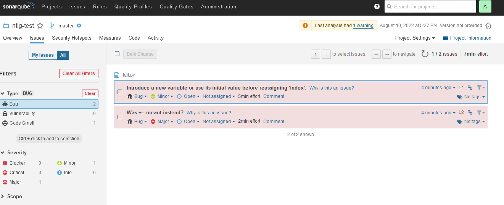
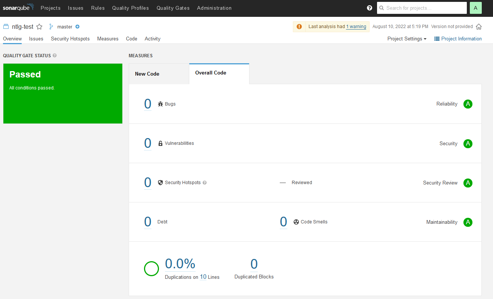
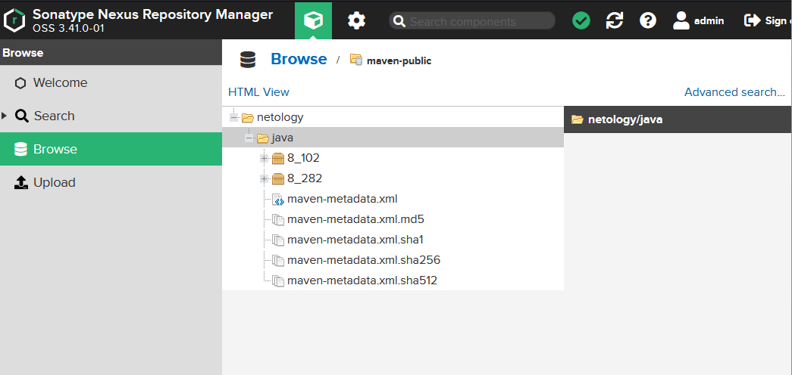

# Домашнее задание к занятию "09.02 CI\CD"

## Знакомоство с SonarQube

### Подготовка к выполнению

1. Выполняем `docker pull sonarqube:8.7-community`
2. Выполняем `docker run -d --name sonarqube -e SONAR_ES_BOOTSTRAP_CHECKS_DISABLE=true -p 9000:9000 sonarqube:8.7-community`
3. Ждём запуск, смотрим логи через `docker logs -f sonarqube`
4. Проверяем готовность сервиса через [браузер](http://localhost:9000)
5. Заходим под admin\admin, меняем пароль на свой

В целом, в [этой статье](https://docs.sonarqube.org/latest/setup/install-server/) описаны все варианты установки, включая и docker, но так как нам он нужен разово, то достаточно того набора действий, который я указал выше.

---

**Подготовка.**

```bash
$ docker pull sonarqube:8.7-community
8.7-community: Pulling from library/sonarqube
22599d3e9e25: Pull complete 
00bb4d95f2aa: Pull complete 
3ef8cf8a60c8: Pull complete 
928990dd1bda: Pull complete 
07cca701c22e: Pull complete 
Digest: sha256:70496f44067bea15514f0a275ee898a7e4a3fedaaa6766e7874d24a39be336dc
Status: Downloaded newer image for sonarqube:8.7-community
docker.io/library/sonarqube:8.7-community
$ docker run -d --name sonarqube -e SONAR_ES_BOOTSTRAP_CHECKS_DISABLE=true -p 9000:9000 sonarqube:8.7-community
0c79bc705b1f5b27d156fc3ddefe516384daeccf618594e7387de0fe2a511c0b

```

---

### Основная часть

1. Создаём новый проект, название произвольное
2. Скачиваем пакет sonar-scanner, который нам предлагает скачать сам sonarqube
3. Делаем так, чтобы binary был доступен через вызов в shell (или меняем переменную PATH или любой другой удобный вам способ)
4. Проверяем `sonar-scanner --version`
5. Запускаем анализатор против кода из директории [example](./example) с дополнительным ключом `-Dsonar.coverage.exclusions=fail.py`
6. Смотрим результат в интерфейсе
7. Исправляем ошибки, которые он выявил(включая warnings)
8. Запускаем анализатор повторно - проверяем, что QG пройдены успешно
9. Делаем скриншот успешного прохождения анализа, прикладываем к решению ДЗ

---

**Ответ**

1. Создаем новый проект. `ntlg-test`  
2. [Sonar-scanner](https://binaries.sonarsource.com/Distribution/sonar-scanner-cli/sonar-scanner-cli-4.7.0.2747-linux.zip)  
3. Меняем переменную PATH.

```bash
~/sonar/bin$ export PATH=$PATH:$(pwd)
```

4. Проверяем `sonar-scanner --version`

```bash
$ sonar/bin/sonar-scanner --version
INFO: Scanner configuration file: /home/exad/sonar/conf/sonar-scanner.properties
INFO: Project root configuration file: NONE
INFO: SonarScanner 4.7.0.2747
INFO: Java 11.0.14.1 Eclipse Adoptium (64-bit)
INFO: Linux 5.10.102.1-microsoft-standard-WSL2 amd64
```

5. Запускаем анализатор против кода из директории [example](./example) с дополнительным ключом `-Dsonar.coverage.exclusions=fail.py`

```bash
sonar-scanner \
  -Dsonar.projectKey=ntlg-test \
  -Dsonar.sources=. \
  -Dsonar.host.url=http://localhost:9000 \
  -Dsonar.login=abd4402532cd151393c09a6470d6ba42a9bf28dd\
  -Dsonar.coverage.exclusions=fail.py

```

6. Наблюдаем ошибки.  


7. Исправляем ошибки.

```python
def increment(index):
    return index+1
def get_square(numb):
    return numb*numb
def print_numb(numb):
    print("Number is {}".format(numb))

index = 0
while (index < 10):
    index = increment(index)
    print(get_square(index))
```

8. Запускаем анализатор повторно - проверяем, что QG пройдены успешно.  
9. Делаем скриншот успешного прохождения анализа, прикладываем к решению ДЗ.
 

---

## Знакомство с Nexus

### Подготовка к выполнению

1. Выполняем `docker pull sonatype/nexus3`
2. Выполняем `docker run -d -p 8081:8081 --name nexus sonatype/nexus3`
3. Ждём запуск, смотрим логи через `docker logs -f nexus`
4. Проверяем готовность сервиса через [бразуер](http://localhost:8081)
5. Узнаём пароль от admin через `docker exec -it nexus /bin/bash`
6. Подключаемся под админом, меняем пароль, сохраняем анонимный доступ

---

**Ответ**
1. 
```
$ docker pull sonatype/nexus3                                                                                   130 ↵
Using default tag: latest
latest: Pulling from sonatype/nexus3
0c673eb68f88: Pull complete
028bdc977650: Pull complete
887448ad6f44: Pull complete
70daa52d5897: Pull complete
Digest: sha256:d0f242d00a2f93f1bdf4e30cb2c0d1be03217f792db5af17727871bae04783da
Status: Downloaded newer image for sonatype/nexus3:latest
docker.io/sonatype/nexus3:latest
```
2. 
```
$ docker run -d -p 8081:8081 --name nexus sonatype/nexus3
18d98fc334d6cda277d14c39cf46eeb32bd338cbbc786b0218ad277af4f7f76c
```
5. 
```
$ docker exec -it nexus /bin/bash                                                                               255 ↵
bash-4.4$ cat nexus-data/admin.password
909e42d8-f642-4585-8c16-c84579c82325
```
---

### Основная часть

1. В репозиторий `maven-public` загружаем артефакт с GAV параметрами:
   1. groupId: netology
   2. artifactId: java
   3. version: 8_282
   4. classifier: distrib
   5. type: tar.gz
2. В него же загружаем такой же артефакт, но с version: 8_102
3. Проверяем, что все файлы загрузились успешно
4. В ответе присылаем файл `maven-metadata.xml` для этого артефекта

---



### Знакомство с Maven

### Подготовка к выполнению

1. Скачиваем дистрибутив с [maven](https://maven.apache.org/download.cgi)

```bash
$ wget https://dlcdn.apache.org/maven/maven-3/3.8.6/binaries/apache-maven-3.8.6-bin.tar.gz
--2022-08-10 23:21:05--  https://dlcdn.apache.org/maven/maven-3/3.8.6/binaries/apache-maven-3.8.6-bin.tar.gz
Resolving dlcdn.apache.org (dlcdn.apache.org)... 151.101.2.132, 2a04:4e42::644
Connecting to dlcdn.apache.org (dlcdn.apache.org)|151.101.2.132|:443... connected.
HTTP request sent, awaiting response... 200 OK
Length: 8676320 (8.3M) [application/x-gzip]
Saving to: ‘apache-maven-3.8.6-bin.tar.gz’

apache-maven-3.8.6-bin.tar.gz 100%[=================================================>]   8.27M   533KB/s    in 31s

2022-08-10 23:21:40 (274 KB/s) - ‘apache-maven-3.8.6-bin.tar.gz’ saved [8676320/8676320]
```

2. Разархивируем, делаем так, чтобы binary был доступен через вызов в shell (или меняем переменную PATH или любой другой удобный вам способ)

```bash
tar -xvf apache-maven-3.8.6-bin.tar.gz
```

3. Проверяем `mvn --version`

```bash
$ mvn --version
Apache Maven 3.8.6 (84538c9988a25aec085021c365c560670ad80f63)
Maven home: /home/exad/netology-hw/9.2-cicd/mvn/apache-maven-3.8.6
Java version: 11.0.16, vendor: Ubuntu, runtime: /usr/lib/jvm/java-11-openjdk-amd64
Default locale: en, platform encoding: UTF-8
OS name: "linux", version: "5.10.102.1-microsoft-standard-wsl2", arch: "amd64", family: "unix"
```

4. Забираем директорию [mvn](./mvn) с pom

### Основная часть

1. Меняем в `pom.xml` блок с зависимостями под наш артефакт из первого пункта задания для Nexus (java с версией 8_282)
2. Запускаем команду `mvn package` в директории с `pom.xml`, ожидаем успешного окончания
3. Проверяем директорию `~/.m2/repository/`, находим наш артефакт

```
$ ll ~/.m2/repository/netology/java/8_282
total 20K
-rw-r--r-- 1 exad exad  175 Aug 10 23:28 _remote.repositories
-rw-r--r-- 1 exad exad 5.4K Aug 10 23:28 java-8_282-distrib.tar.gz
-rw-r--r-- 1 exad exad   40 Aug 10 23:28 java-8_282-distrib.tar.gz.sha1
-rw-r--r-- 1 exad exad  382 Aug 10 23:28 java-8_282.pom.lastUpdated
```

4. В ответе присылаем исправленный файл `pom.xml`


---


