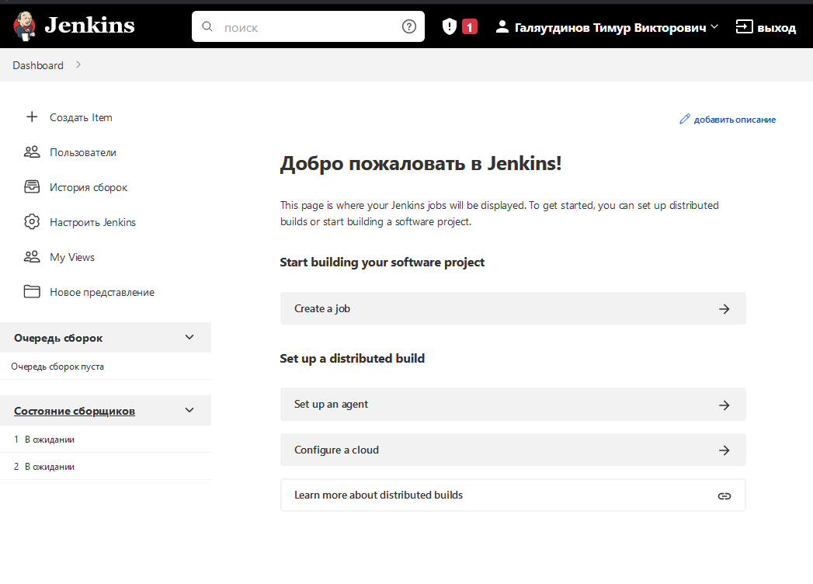
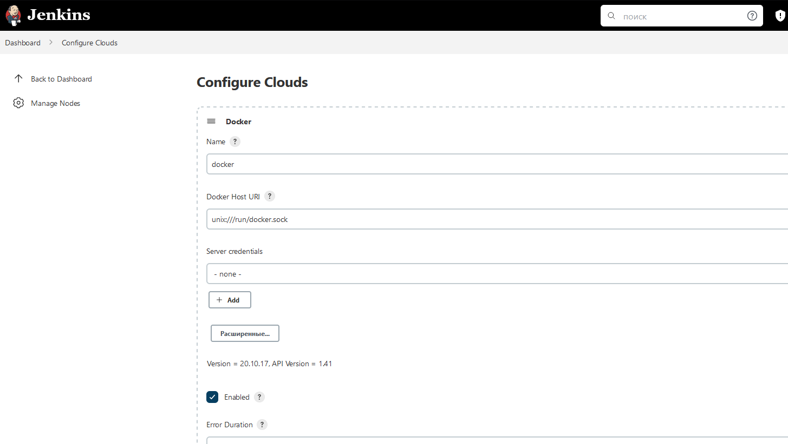
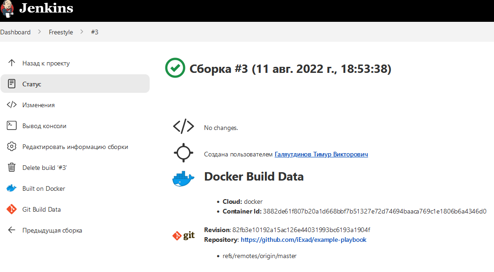
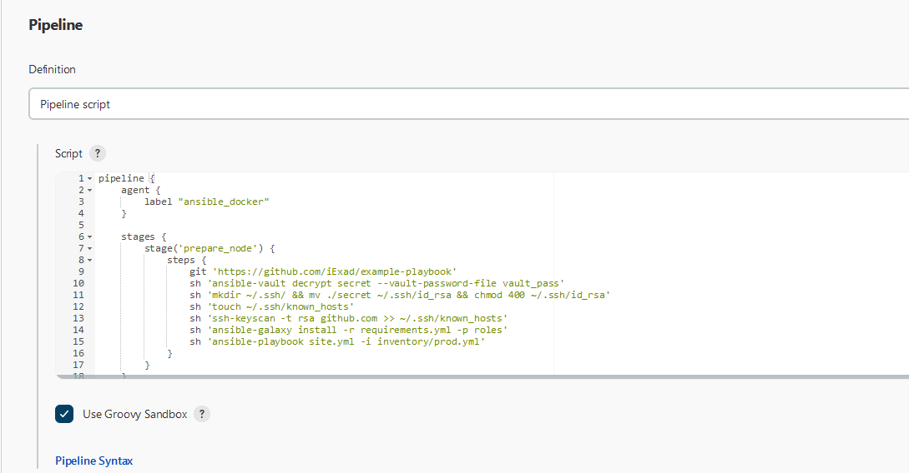
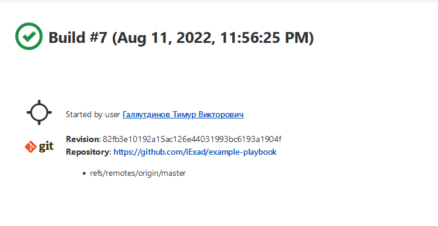
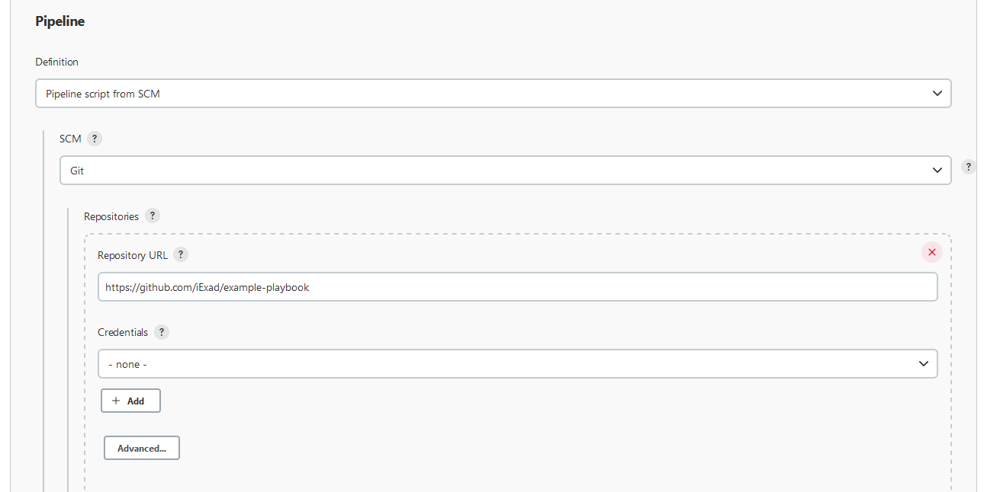
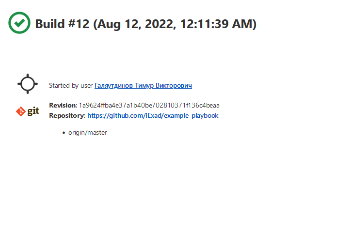
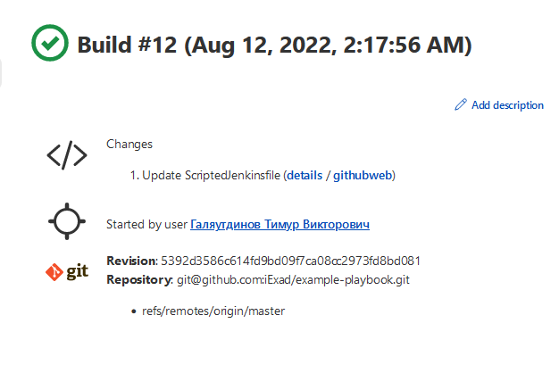

# Домашнее задание к занятию "09.03 Jenkins"

## Подготовка к выполнению

1. Установить jenkins по любой из [инструкций](https://www.jenkins.io/download/)

---

**Ставим jenkins.**

```bash
curl -fsSL https://pkg.jenkins.io/debian-stable/jenkins.io.key | sudo tee \
  /usr/share/keyrings/jenkins-keyring.asc > /dev/null
echo deb [signed-by=/usr/share/keyrings/jenkins-keyring.asc] \
  https://pkg.jenkins.io/debian-stable binary/ | sudo tee \
  /etc/apt/sources.list.d/jenkins.list > /dev/null
sudo apt-get update
sudo apt-get install jenkins openjdk-11-jre

```

---

2. Запустить и проверить работоспособность

---



---

3. Сделать первоначальную настройку
4. Настроить под свои нужды
5. Поднять отдельный cloud

---




---

6. Для динамических агентов можно использовать [образ](https://hub.docker.com/repository/docker/aragast/agent)

---

```bash
$ docker pull aragast/agent:7                                                                                                                                        255 ↵
7: Pulling from aragast/agent
ab5ef0e58194: Pull complete 
1e72a26aff50: Pull complete 
f77543c42f4c: Pull complete 
7422d683f4c6: Pull complete 
e71ed7ae47d2: Pull complete 
Digest: sha256:ebf0a78bcb580c8497efdc256c8b9a9b8293e50adc1e05a7549e7d861c93edf8
Status: Downloaded newer image for aragast/agent:7
docker.io/aragast/agent:7
```

---

7. Обязательный параметр: поставить label для динамических агентов: `ansible_docker`

---


---

8.  Сделать форк репозитория с [playbook](https://github.com/aragastmatb/example-playbook)

---

---

## Основная часть

1. Сделать Freestyle Job, который будет запускать `ansible-playbook` из форка репозитория



```
PLAY RECAP *********************************************************************
localhost                  : ok=5    changed=4    unreachable=0    failed=0    skipped=1    rescued=0    ignored=0   

Finished: SUCCESS
```

---

2. Сделать Declarative Pipeline, который будет выкачивать репозиторий с плейбукой и запускать её

---




```bash
PLAY RECAP *********************************************************************
localhost                  : ok=5    changed=4    unreachable=0    failed=0    skipped=1    rescued=0    ignored=0   

[Pipeline] }
[Pipeline] // stage
[Pipeline] }
[Pipeline] // node
[Pipeline] End of Pipeline
Finished: SUCCESS
```


3. Перенести Declarative Pipeline в репозиторий в файл `Jenkinsfile`

---

4. Перенастроить Job на использование `Jenkinsfile` из репозитория

---




```
PLAY RECAP *********************************************************************
localhost                  : ok=5    changed=4    unreachable=0    failed=0    skipped=1    rescued=0    ignored=0   

[Pipeline] }
[Pipeline] // stage
[Pipeline] }
[Pipeline] // withEnv
[Pipeline] }
[Pipeline] // node
[Pipeline] End of Pipeline
Finished: SUCCESS
```

---

5. Создать Scripted Pipeline, наполнить его скриптом из [pipeline](./pipeline)
6. Заменить credentialsId на свой собственный
7. Проверить работоспособность, исправить ошибки, исправленный Pipeline вложить в репозитрий в файл `ScriptedJenkinsfile`

---



```
PLAY RECAP *********************************************************************
localhost                  : ok=5    changed=4    unreachable=0    failed=0    skipped=1    rescued=0    ignored=0   

[Pipeline] }
[Pipeline] // stage
[Pipeline] }
[Pipeline] // node
[Pipeline] End of Pipeline
Finished: SUCCESS
```

---

8. Отправить ссылку на репозиторий в ответе

---

[репозиторий](https://github.com/iExad/example-playbook)

---
