# Диполомный практикум в YandexCloud

## Этапы выполнения

### 1. Регистрация доменного имени

Взят уже купленный домен `jdmkzn.ru` и делегирован под управление CLoud DNS в YC

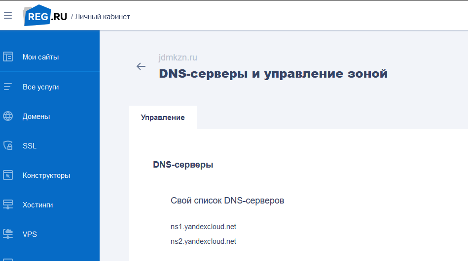

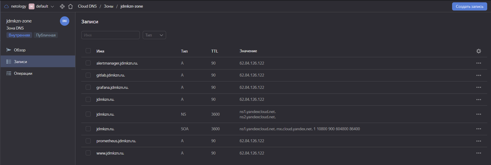

### 2. Создание инфраструктуры

1. Создан аккаунт в YandexCloud. Создан сервисный аккаунт и сгенерирован ключ доступа к YC

2. Создан s3-bucket. Выбран вариант с S3 bucket в созданном YC аккаунте

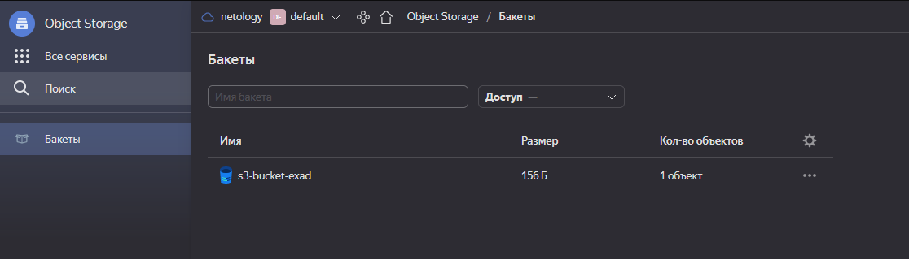


3. Настройка workspaces

```bash
$ terraform workspace new stage
$ terraform workspace list
  default
* stage
```

4. Создана VPC с подсетями

```
resource "yandex_vpc_network" "network-1" {
  name = "network-${local.workspace[terraform.workspace]}-${local.instance_count[terraform.workspace]}"
}

resource "yandex_vpc_subnet" "subnet-1" {
  name           = "subnet-${local.instance_count[terraform.workspace]}-${local.workspace[terraform.workspace]}"
  zone           = local.vpc_zone[terraform.workspace]
  network_id     = yandex_vpc_network.network-1.id
  v4_cidr_blocks = local.vpc_v4_cidr_blocks[terraform.workspace]
  route_table_id          = yandex_vpc_route_table.nat.id
}

resource "yandex_vpc_route_table" "nat" {
  network_id = "${yandex_vpc_network.network-1.id}"

  static_route {
    destination_prefix = "0.0.0.0/0"
    next_hop_address   = "192.168.1.10"
  }
}

locals {
  instance_count = {
    stage   = 1
  }
  vpc_zone  = {
    stage   = "ru-central1-a"
  }
  vpc_v4_cidr_blocks = {
    stage   = ["192.168.1.0/24"]
  }
  workspace = {
    stage   = "stage"
  }
}
```
5. `terraform apply` и `terraform destroy` отрабатывают.
Создан файл `variables.tf` и объявлены все необходимые переменные. Значения переменных заданы в `terraform.tfvars`.

### 3. Установка Nginx и Let'sEncrypt

Terraform'ом в домене настроены все А-записи на внешний адрес сервера с nginx через yandex_dns_recordset

`https://www.jdmkzn.ru` (Wordpress)
`https://gitlab.jdmkzn.ru` (Gitlab)
`https://grafana.jdmkzn.ru` (Grafana)
`https://prometheus.jdmkzn.ru`(Prometheus)
`https://alertmanager.jdmkzn.ru` (Alert Manager)

### 4. Установка кластера MySQL

Терраформом создаются инстансы с mysql с указанными в задании ресурсами.
Ролью Ansible устанавливаются пакеты mysql и настраиваются как master и slave.

### 5. Установка wordpress

Виртуальная машина на которой установлен WordPress и Nginx/Apache (на ваше усмотрение). В вашей доменной зоне настроена A-запись на внешний адрес reverse proxy: https://www.jdmkzn.ru (WordPress) На сервере jdmkzn.run отредактирован upstream для выше указанного URL и он смотрит на виртуальную машину на которой установлен WordPress. В браузере можно открыть URL https://www.jdmkzn.ru и увидеть главную страницу WordPress.

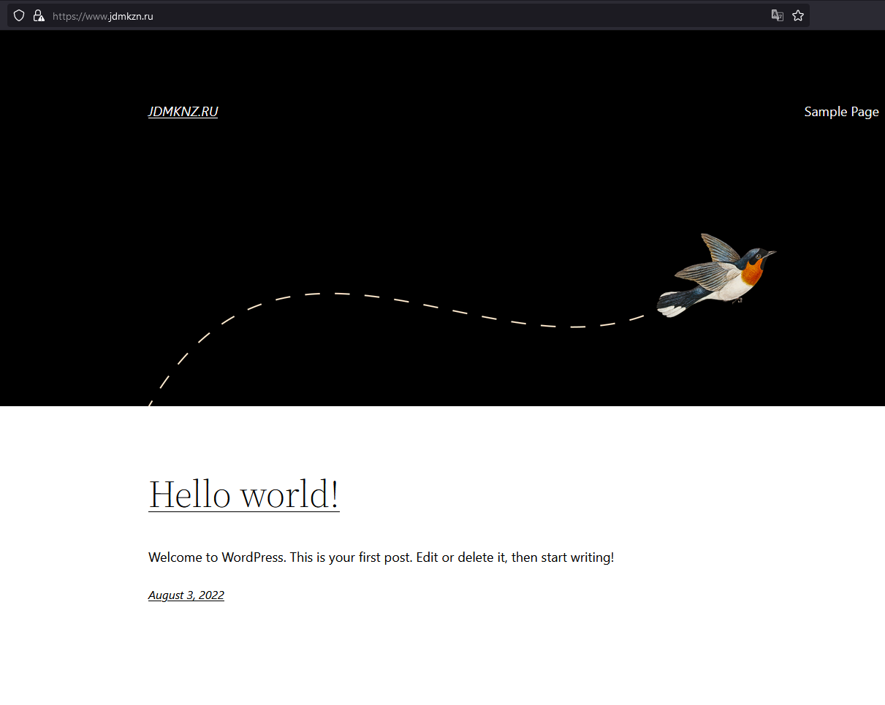

### 6. Установка Gitlab CE и Gitlab Runner

Интерфейс Gitlab доступен по https. В вашей доменной зоне настроена A-запись на внешний адрес reverse proxy: https://gitlab.jdmkzn.ru (Gitlab) На сервере jdmkzn.ru отредактирован upstream для выше указанного URL и он смотрит на виртуальную машину на которой установлен Gitlab. При любом коммите в репозиторий с WordPress и создании тега (например, v1.0.0) происходит деплой на виртуальную машину.

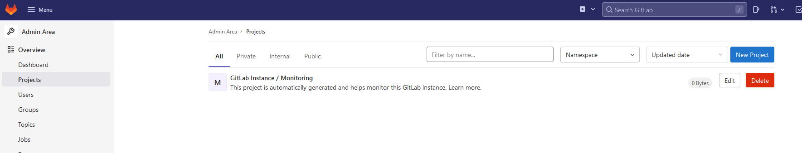

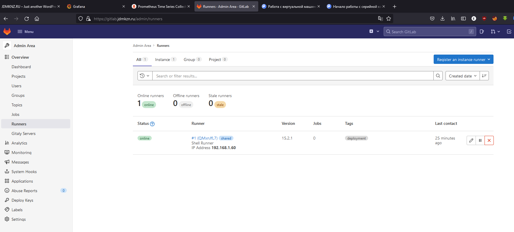

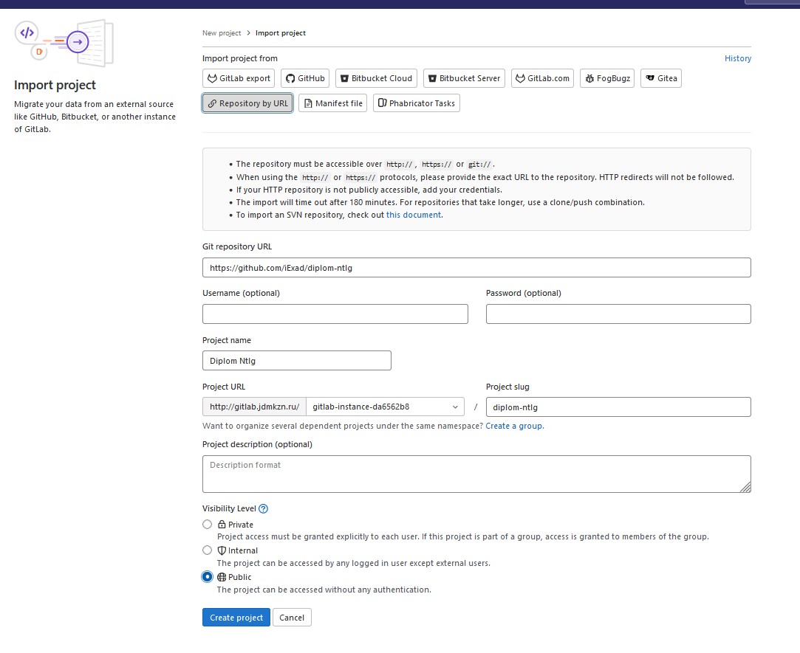

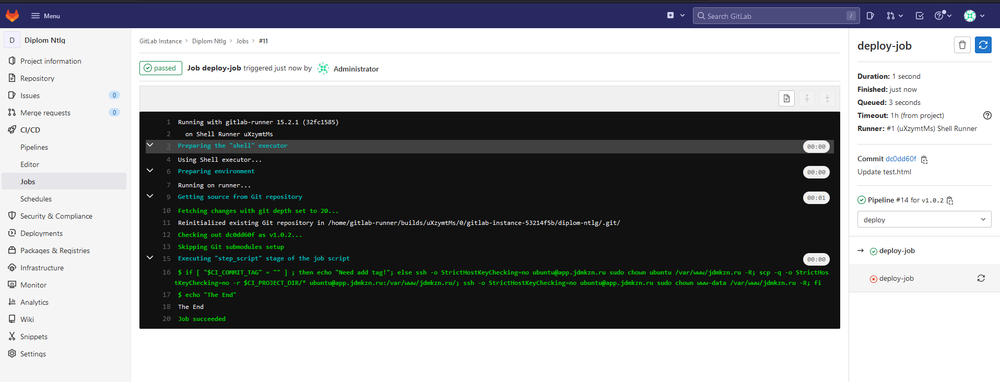

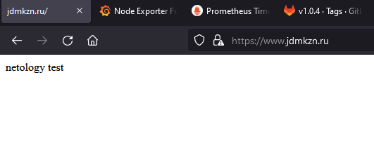

### 7. Установка Prometheus, Alert Manager, Node Exporter и Grafana

Интерфейсы Prometheus, Alert Manager и Grafana доступены по https. В вашей доменной зоне настроены A-записи на внешний адрес reverse proxy:

• `https://grafana.jdmkzn.ru` (Grafana)

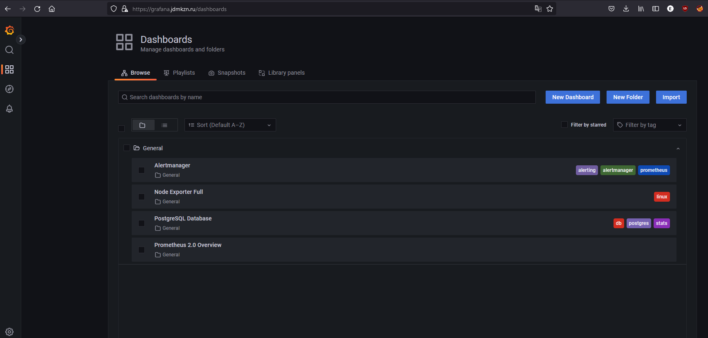

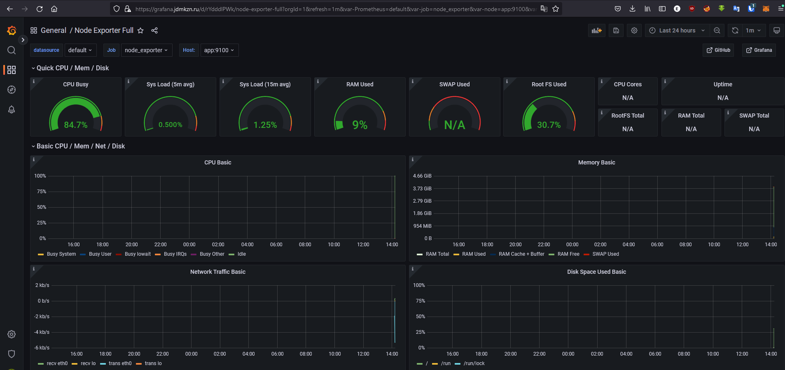

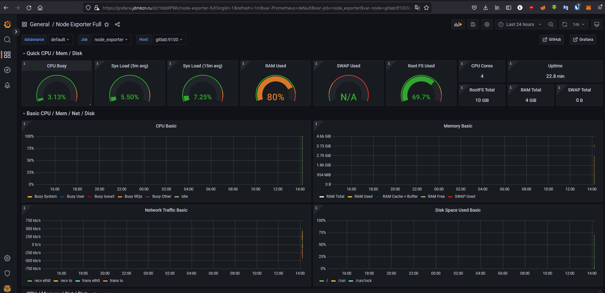

• `https://prometheus.jdmkzn.ru` (Prometheus)

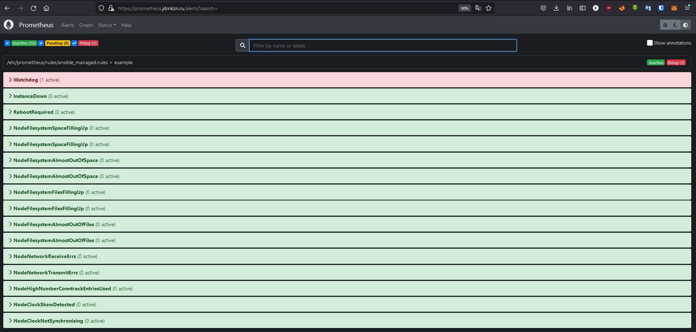

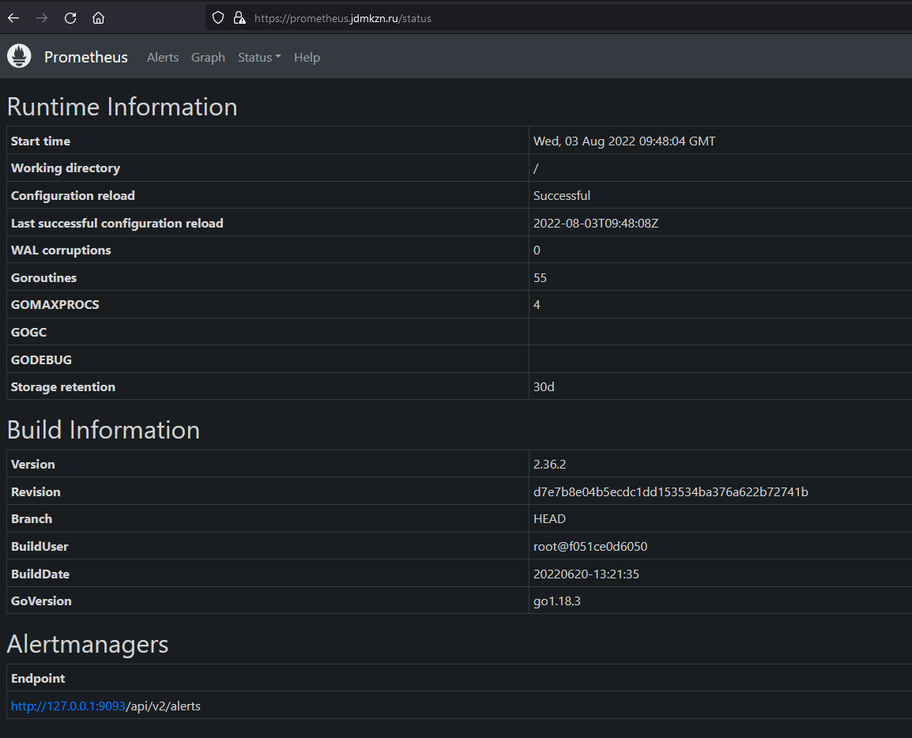

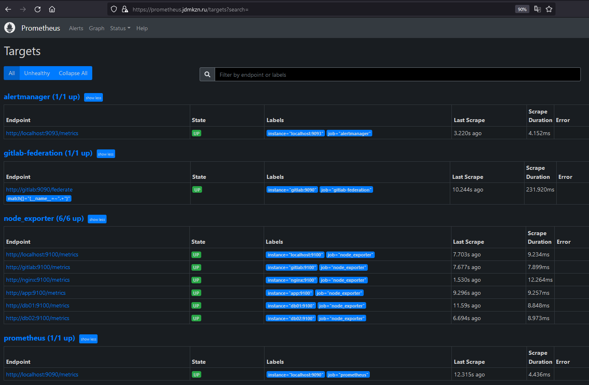

• `https://alertmanager.jdmkzn.ru` (Alert Manager)

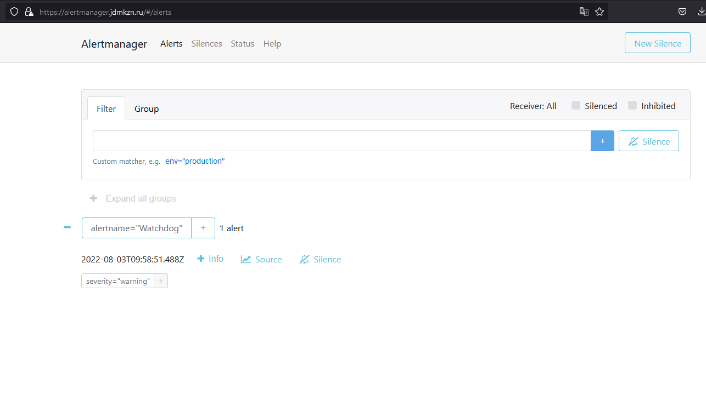

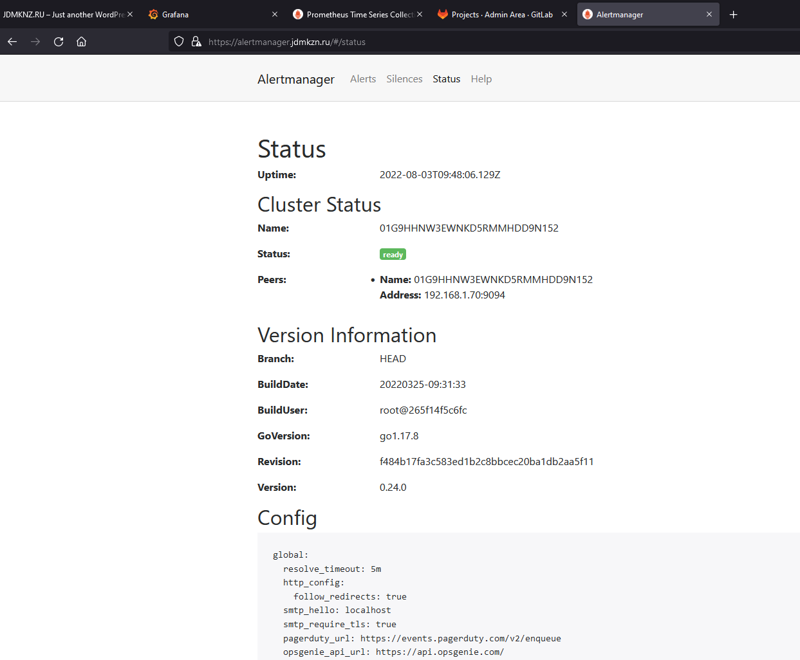

На сервере jdmkzn.ru отредактированы upstreams для выше указанных URL и они смотрят на виртуальную машину на которой установлены Prometheus, Alert Manager и Grafana. На всех серверах установлен Node Exporter и его метрики доступны Prometheus. 

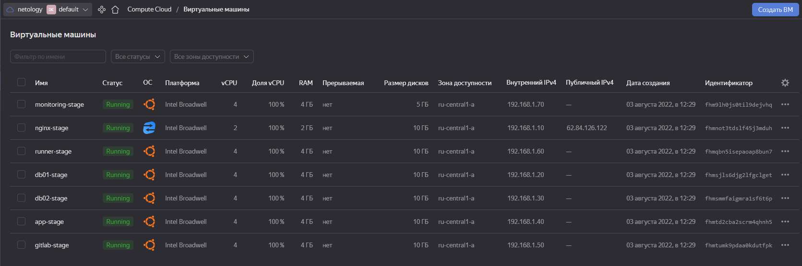

