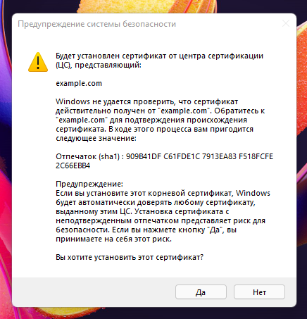
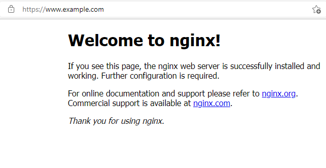

### Курсовая работа по итогам модуля "DevOps и системное администрирование"

1. Установил ВМ с Ubuntu 20.04 LTS

2. Пакет `ufw` установлен в ubuntu "из коробки"

```
root@devsys-pdc-2:~# ufw status verbose
Status: inactive

root@devsys-pdc-2:~# ufw enable
Command may disrupt existing ssh connections. Proceed with operation (y|n)? y
Firewall is active and enabled on system startup

root@devsys-pdc-2:~# ufw status verbose
Status: active
Logging: on (low)
Default: deny (incoming), allow (outgoing), disabled (routed)
New profiles: skip

ufw allow ssh
ufw allow https
ufw allow from 127.0.0.1

```

3. Установлен `vault`

```
exad@devsys-pdc-2:~$ vault
Usage: vault <command> [args]

Common commands:
    read        Read data and retrieves secrets
    write       Write data, configuration, and secrets
    delete      Delete secrets and configuration
    list        List data or secrets
    login       Authenticate locally
    agent       Start a Vault agent
    server      Start a Vault server
    status      Print seal and HA status
    unwrap      Unwrap a wrapped secret

Other commands:
    audit          Interact with audit devices
    auth           Interact with auth methods
    debug          Runs the debug command
    kv             Interact with Vault's Key-Value storage
    lease          Interact with leases
    monitor        Stream log messages from a Vault server
    namespace      Interact with namespaces
    operator       Perform operator-specific tasks
    path-help      Retrieve API help for paths
    plugin         Interact with Vault plugins and catalog
    policy         Interact with policies
    print          Prints runtime configurations
    secrets        Interact with secrets engines
    ssh            Initiate an SSH session
    token          Interact with tokens
```

4. Создание центра сертификации и выпуск сертификата для использования его в настройке веб-сервера nginx со сроком жизни 1 мес.

Стартуем vault сервер в dev режиме
```
vault server -dev -dev-root-token-id root
```

Добавляем в переменные окружения:

```
exad@devsys-pdc-2:~$ export VAULT_ADDR=http://127.0.0.1:8200
exad@devsys-pdc-2:~$ export VAULT_TOKEN=root
```

Генерим корневой серт для CA:

```
exad@devsys-pdc-2:~$ vault secrets enable pki
Success! Enabled the pki secrets engine at: pki/
exad@devsys-pdc-2:~$ export VAULT_TOKEN=root^C
exad@devsys-pdc-2:~$ vault secrets tune -max-lease-ttl=87600h pki
Success! Tuned the secrets engine at: pki/
exad@devsys-pdc-2:~$ vault write -field=certificate pki/root/generate/internal common_name="example.com" ttl=87600h > CA_cert.crt
```

Генерим адреса для CA и CRL:

```
exad@devsys-pdc-2:~$ vault write pki/config/urls issuing_certificates="$VAULT_ADDR/v1/pki/ca" crl_distribution_points="$VAULT_ADDR/v1/pki/crl"
Success! Data written to: pki/config/urls
```

Генерим промежуточный сертификат:

```
exad@devsys-pdc-2:~$ vault secrets enable -path=pki_int pki
Success! Enabled the pki secrets engine at: pki_int/
exad@devsys-pdc-2:~$ vault secrets tune -max-lease-ttl=43800h pki_int
Success! Tuned the secrets engine at: pki_int/
exad@devsys-pdc-2:~$ vault write -format=json pki_int/intermediate/generate/internal common_name="example.com Intermediate Authority" | jq -r '.data.csr' > pki_intermediate.csr
```

Подписываем промежуточный сертификат корневым сертификатом нашего CA:

```
exad@devsys-pdc-2:~$ vault write -format=json pki/root/sign-intermediate csr=@pki_intermediate.csr format=pem_bundle ttl="43800h" | jq -r '.data.certificate' > intermediate.cert.pem
exad@devsys-pdc-2:~$ vault write pki_int/intermediate/set-signed certificate=@intermediate.cert.pem
Success! Data written to: pki_int/intermediate/set-signed
```

Добавляем роль vault для сайта

```
exad@devsys-pdc-2:~$ vault write pki_int/roles/example-dot-com allowed_domains="example.com" allow_subdomains=true max_ttl="720h"
Success! Data written to: pki_int/roles/example-dot-com
```

Генерируем серт для сайта и разделяем их для nginx:

```
vault write -format=json pki_int/issue/example-dot-com common_name="www.example.com" ttl="720h" > www.example.com.crt
exad@devsys-pdc-2:~$ sudo cat www.example.crt | jq -r .data.certificate > /etc/nginx/ssl/www.example.com.pem
exad@devsys-pdc-2:~$ sudo cat www.example.crt | jq -r .data.ca_chain[] >> /etc/nginx/ssl/www.example.com.pem
exad@devsys-pdc-2:~$ sudo cat www.example.crt | jq -r .data.private_key > /etc/nginx/ssl/www.example.com.key
```

5. Установите корневой сертификат созданного центра сертификации в доверенные в хостовой системе.

```
exad@devsys-pdc-2:~$ cat CA_cert.crt
-----BEGIN CERTIFICATE-----
MIIDNTCCAh2gAwIBAgIUGQrl7Mucr5kzgvoHi82qVpqDQ7YwDQYJKoZIhvcNAQEL
BQAwFjEUMBIGA1UEAxMLZXhhbXBsZS5jb20wHhcNMjIwMjA0MDAwNDM0WhcNMzIw
MjAyMDAwNTA0WjAWMRQwEgYDVQQDEwtleGFtcGxlLmNvbTCCASIwDQYJKoZIhvcN
AQEBBQADggEPADCCAQoCggEBALzaXWCI8MWYZ1xqGm3co9kpuWprO2ttb2POa63c
274Lipbl4NKbQQM2AcKbM9RTTMRGcIhFw3310XjSZ6BbkN3ggyX9b+PsBFMbeLYP
DpzegV9Y3/0OQI9BC5yjD0BYweqn1VNJ/OIKJEIeHtSglip5HTqL/Tf9sZ3bkzLN
iEShkAV768THLVysn24bwEdnASu8YGWoJxuZDdi6NeXbU4V15a796MLha9g3511a
whbz+Hn1nRx4lChD56X0Z7mzyUlkPndfw6zqe/flKXW79Pu0lLNLY9yZLO8UAFG/
s5nqcJo/EG/MNQAWHeXRTlPO3+RSwqk/BpDghMd+Rc7HugUCAwEAAaN7MHkwDgYD
VR0PAQH/BAQDAgEGMA8GA1UdEwEB/wQFMAMBAf8wHQYDVR0OBBYEFNxJ6DI8xYTu
rdERGkmo8NZZATeWMB8GA1UdIwQYMBaAFNxJ6DI8xYTurdERGkmo8NZZATeWMBYG
A1UdEQQPMA2CC2V4YW1wbGUuY29tMA0GCSqGSIb3DQEBCwUAA4IBAQCEYgxjMdWT
Ds08Ti7HQnJ3p671ESLAYGKorTSmm32puHriDEXnX++xe5zb/s/RV/uIqx2Q7QHe
bs+BX2fPFeqAlXYat/iDdxfcmOTfoqCNbp+1DI9Os7siurY6eAQFW+4aBMWhWkiB
7pPJYy8KTk9Y6h7c0NTyt6kPaBryZ9pXRwYScxzD331GeQWSGmOMIEy8+7cHhwBr
JPAyTxql2slVdLb74C+o/lBfC0nXnKecsXJV7uZB0ixnwQcMTlTgO2w+zu/TPUxp
/dDOtatOm7c1OiC+zo1y0QIrvTJ+/4LsDW1mnUfQNKno3KnPNQzt6X0vd+vnmobR
8wAgckW7tUrL
-----END CERTIFICATE-----
```

Сохранил в crt файл на пк и импортировал в Доверенные корневые центры сертификации.



6. Установите Nginx

```
exad@devsys-pdc-2:~$ sudo apt install curl gnupg2 ca-certificates lsb-release ubuntu-keyring
exad@devsys-pdc-2:~$ curl https://nginx.org/keys/nginx_signing.key | gpg --dearmor | sudo tee /usr/share/keyrings/nginx-archive-keyring.gpg >/dev/null
  % Total    % Received % Xferd  Average Speed   Time    Time     Time  Current
                                 Dload  Upload   Total   Spent    Left  Speed
100  1561  100  1561    0     0   1946      0 --:--:-- --:--:-- --:--:--  1946

exad@devsys-pdc-2:~$ echo "deb [signed-by=/usr/share/keyrings/nginx-archive-keyring.gpg] http://nginx.org/packages/ubuntu `lsb_release -cs` nginx" | sudo tee /etc/apt/sources.list.d/nginx.list
deb [signed-by=/usr/share/keyrings/nginx-archive-keyring.gpg] http://nginx.org/packages/ubuntu focal nginx
exad@devsys-pdc-2:~$ sudo apt update
exad@devsys-pdc-2:~$ sudo apt install nginx
```

7. По инструкции (ссылка) настройте nginx на https, используя ранее подготовленный сертификат:

```
exad@devsys-pdc-2:~$ sudo vim /etc/nginx/conf.d/www.example.com.conf
```

```
server {
    listen 443 ssl;
    server_name         www.example.com;
    ssl_certificate     /etc/nginx/ssl/www.example.com.pem;
    ssl_certificate_key /etc/nginx/ssl/www.example.com.key;
    ssl_protocols       TLSv1 TLSv1.1 TLSv1.2;
    ssl_ciphers         HIGH:!aNULL:!MD5;
    ssl_prefer_server_ciphers on;
    location / {
        root   /usr/share/nginx/html;
        index  index.html index.htm;
    }
}
```

```
exad@devsys-pdc-2:~$ sudo nginx -t
nginx: the configuration file /etc/nginx/nginx.conf syntax is ok
nginx: configuration file /etc/nginx/nginx.conf test is successful
```

```
sudo systemctl enable nginx
sudo systemctl start nginx
```

На пк в хосты прописал `192.168.198.155             www.example.com`


8. Откройте в браузере на хосте https адрес страницы, которую обслуживает сервер nginx.


скрин сайта



скрин сайта с информацией о сертификате


9. Создайте скрипт, который будет генерировать новый сертификат в vault:

```bash
#!/usr/bin/env bash
export VAULT_ADDR=http://127.0.0.1:8200
export VAULT_TOKEN=root
vault write -format=json pki_int/issue/example-dot-com common_name="www.example.com" ttl="720h" > www.example.com.crt
cat www.example.crt | sudo jq -r .data.certificate > /etc/nginx/ssl/www.example.com.pem
cat www.example.crt | sudo jq -r .data.ca_chain[] >> /etc/nginx/ssl/www.example.com.pem
cat www.example.crt | sudo jq -r .data.private_key > /etc/nginx/ssl/www.example.com.key
sudo mv www.example.com.pem /etc/nginx/ssl/
sudo mv www.example.com.key /etc/nginx/ssl/
sudo systemctl restart nginx
```

10. Поместите скрипт в crontab, чтобы сертификат обновлялся какого-то числа каждого месяца в удобное для вас время.

```
crontab -e

0 0 1 * * /home/exad/renew-cert.sh
```
